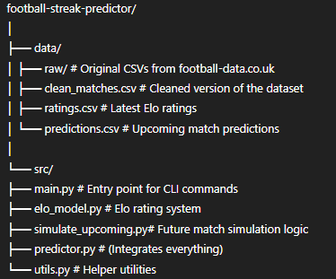

# Win-Streak-Predictor-
If you ever for some reason want to find out if Man united will win 5 games? Just check the probability, it never good.. 

**Input:** Analyzes Manchester United remaining / current fixtures

**Output:** Per-match win probability, projected points, and probability United hits any 5-game win streak this season

After running: you get data/predictions.csv — next fixtures with p_home_win, p_draw, p_away_win, and United’s projected points per game

Terminal summary — “Best 5-game window …” and “Approx ANY 5-in-a-row …” for United

**Tools Used:** 
-   `pandas`, `numpy`, `pathlib`
**Modeling:**
-   Simple **Elo** rating system (logistic transform, home-advantage, fixed draw share)

**Artifacts:**
  - `data/clean_matches.csv` — cleaned historical results
  - `data/ratings.csv` — team Elo scores
  - `data/predictions.csv` — next fixtures with win/draw/loss probs + projected points
